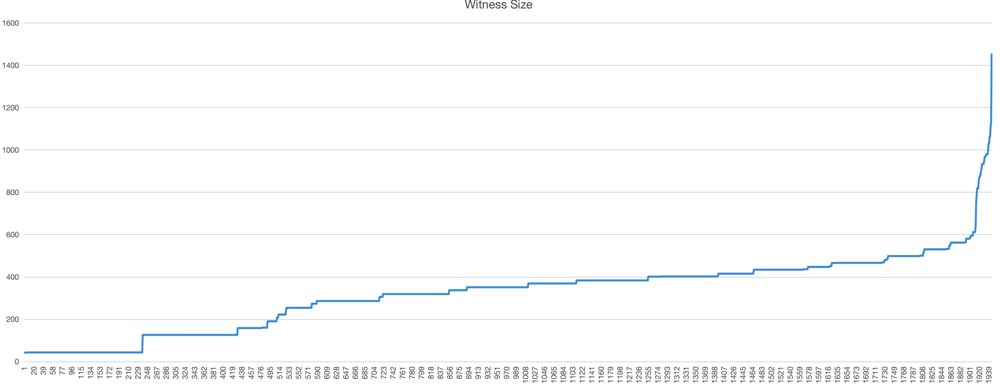
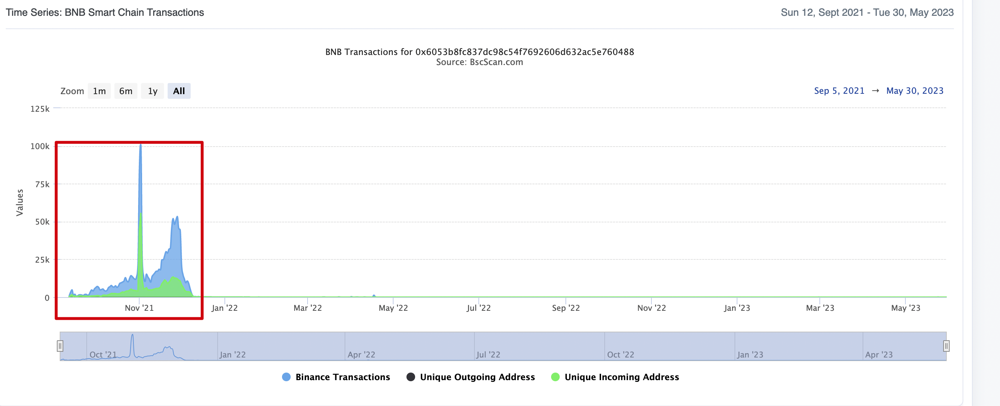
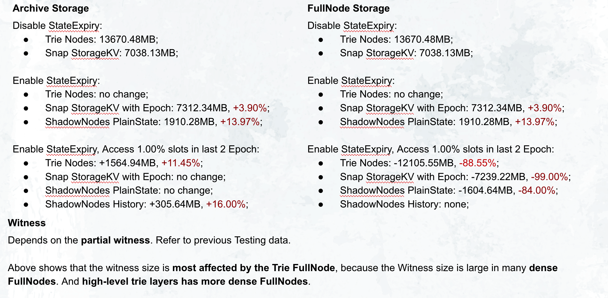

# Storage and Witness Analysis

## Purpose

Construct a contract for a large amount of data, storage trie has at least 3 layers of depth, observe the estimateWitness and revive, witness average size, shadow node storage, snap storage growth, full node storage, prune effect, gas, etc.

Summarize some state expiry storage statistics data.

## Test Scenario

*   BNB transfer;
*   mock 3000 users in a single contract;
    *   transfer to a random user from the deployer;
*   wait 3000 users' state expired;
*   inspect full node storage;
    *   run offline prune;
*   inspect archive node storage;
*   random select user to revive state;
    *   witness depth;
    *   witness size;
    *   gas size;

## Setup Env

<!--Private ([https://app.clickup.com/25652588/docs/revbc-25105/revbc-123385](https://app.clickup.com/25652588/docs/revbc-25105/revbc-123385))-->

### Deploy BEP20

```plain
cd test-contract/deploy-BEP20/
# install deps
npm install
# deploy BEP20 Token
npx hardhat run scripts/deploy.js
```

### Bulk Random Transfer

```plain
cd test-script
# you could modify `randomNum` to change random transfer times. default is 3000
# it will transfer to a random new user in every time,
# you will got a `randomNum` user in this BEP20 contract.
go run test_random_transfer.go > t.log
```

### Inspect storage

```plain
# if you have not install geth-inspect tool, follow below
cd ~/
git clone https://github.com/Fynes/bsc --branch add_inspect_trie inspect-bsc
cd inspect-bsc
go build -o geth-inspect ./cmd/geth
sudo mv geth-inspect /usr/local/bin/

cd ~/state-expiry-poc/
# must stop nodes before inspect
bash scripts/clusterup_set_first.sh stop
# inspect storage, 3000 addr in BEP20, 3859 blocks
./bin/geth db inspect --datadir=./clusterNode/node1/geth/

# output 
+-----------------+--------------------+------------+-------+
|    DATABASE     |      CATEGORY      |    SIZE    | ITEMS |
+-----------------+--------------------+------------+-------+
| Key-Value store | Headers            | 173.63 KiB |   276 |
| Key-Value store | Bodies             | 538.39 KiB |   276 |
| Key-Value store | Receipt lists      | 501.77 KiB |   276 |
| Key-Value store | Difficulties       | 11.94 KiB  |   276 |
| Key-Value store | Block number->hash | 11.32 KiB  |   276 |
| Key-Value store | Block hash->number | 11.05 KiB  |   276 |
| Key-Value store | Transaction index  | 100.80 KiB |  3036 |
| Key-Value store | Bloombit index     | 0.00 B     |     0 |
| Key-Value store | Contract codes     | 164.15 KiB |    12 |
| Key-Value store | Trie nodes         | 957.01 KiB |  6994 |
| Key-Value store | Trie preimages     | 1.11 KiB   |    18 |
| Key-Value store | Account snapshot   | 967.00 B   |    15 |
| Key-Value store | Storage snapshot   | 536.90 KiB |  3372 |
| Key-Value store | Clique snapshots   | 0.00 B     |     0 |
| Key-Value store | Parlia snapshots   | 323.00 B   |     1 |
| Key-Value store | Singleton metadata | 218.57 KiB |    10 |
| Ancient store   | Headers            | 6.00 B     |     0 |
| Ancient store   | Bodies             | 6.00 B     |     0 |
| Ancient store   | Receipt lists      | 6.00 B     |     0 |
| Ancient store   | Difficulties       | 6.00 B     |     0 |
| Ancient store   | Block number->hash | 6.00 B     |     0 |
| Light client    | CHT trie nodes     | 0.00 B     |     0 |
| Light client    | Bloom trie nodes   | 0.00 B     |     0 |
| Shadow Node     | Metadata           | 61.00 B    |     1 |
| Shadow Node     | History            | 734.70 KiB |  3372 |
| Shadow Node     | ChangeSet          | 934.70 KiB |  2032 |
| Shadow Node     | PlainState         | 100.70 KiB |  973  |
+-----------------+--------------------+------------+-------+
|                         TOTAL        |  6.63 MIB  |       |
+-----------------+--------------------+------------+-------+/
```

In the state expiry version, the archive node will add additional state:

*   Shadow node storage, record state expired info, check if expired.
    *   The state epoch is updated at most once during each epoch.
    *   For the shadow branch node, there are at most 16 copies in each epoch, corresponding to the branch node of the MPT.
*   Storage kv of snapshot, add epoch meta, just for pruning.


Some storage size comparison:

*   Each shadow branch node size is fixed, 64 Bytes. Compared with the branch node size of MPT, the size is 49～532 Bytes.
*   Storage kv of snapshot, a fixed 3bytes is added, which is 97bytes compared to the storage kv of snapshot.

### Inspect Storage Trie

```plain
# inspect contract tries
geth-inspect db inspect-trie --datadir=./clusterNode/node1/geth/ latest 10

# output
Contract Trie, total trie num: 8, ShortNodeCnt: 3104, FullNodeCnt: 994, ValueNodeCnt: 3066
+-----------------------------------+-------+--------------+-------------+--------------+
|             TRIETYPE              | LEVEL | SHORTNODECNT | FULLNODECNT | VALUENODECNT |
+-----------------------------------+-------+--------------+-------------+--------------+
|                 -                 |   0   |      0       |      1      |      0       |
|                 -                 |   1   |      0       |     16      |      0       |
|                 -                 |   2   |      0       |     256     |      0       |
|                 -                 |   3   |     1500     |     640     |      0       |
|                 -                 |   4   |     1420     |     58      |     1465     |
|                 -                 |   5   |     119      |      2      |     1418     |
|                 -                 |   6   |      4       |      0      |     119      |
|                 -                 |   7   |      0       |      0      |      4       |
| ContractTrie-11561688151326199371 | Total |     3043     |     973     |     3006     |
+-----------------------------------+-------+--------------+-------------+--------------+
```

It can be found that most of the values are stored at depth 3 and depth 4, so it is estimated that the depth of witnesses based on MPT is mostly at 3 or 4.


But partial revive is not considered at this time. When a high-level layer is revived, the actual witness depth may decrease If it is 2 or even 1, only leaf node witnesses are included, and the witness size is the smallest.


When `Witness[0]`, `Witness[1]`, `Witness[5]` revive `state C` on chain, you only provide `Witness[6]` to revive `state D` .

### Offline Prune

Inline prune only MPT, and there are some issues fixing. So main prune method is offline prune. It used in FullNode model.

```plain
# ensure stop nodes
bash scripts/clusterup_set_first.sh stop
./bin/geth --datadir ./clusterNode/node1/geth/ snapshot prune-state
./bin/geth db inspect --datadir=./clusterNode/node1/geth/

# output
| Key-Value store | Trie nodes         | 12.01 KiB  |   125 | 
| Key-Value store | Trie preimages     | 1.11 KiB   |    18 |
| Key-Value store | Account snapshot   | 967.00 B   |    15 |
| Key-Value store | Storage snapshot   | 0.00 B     |     0 |
| Shadow Node     | Metadata           | 61.00 B    |     1 |
| Shadow Node     | History            | 0.00 B     |     0 |
| Shadow Node     | ChangeSet          | 0.00 B     |     0 |
| Shadow Node     | PlainState         | 0.00 B     |     0 |
```

It can be found that after prune, most of the history of the shadowNode is pruned, and the expired trie and snapshot storage KV are deleted together.


When not all slots expire, trie node, snap storage KV, and shadow node plainState will also remain the unexpired state data.

### EstimateWitness & Revive

```plain
# firstly, restart cluster nodes
bash scripts/clusterup_set_first.sh restart

# estimate all expired states from previous t.log
cd test-script
go run test_batch_bep20_witness_revive.go t.log > r.log

# output
EstimateGasAndReviveState, witness: 2, gas: 70825
wit addr: 0x630899B2b334f12FF31Cf90a5a861aBFb5E1B199, count: 1, gas: 24740
wit proof: 0, depth: 4, totalSize: 1451, size: [532 532 340 47]
wit addr: 0x630899B2b334f12FF31Cf90a5a861aBFb5E1B199, count: 1, gas: 19272
wit proof: 0, depth: 5, totalSize: 1112, size: [532 372 83 83 42]
EstimateGasAndReviveState, witness: 1, gas: 46793
wit addr: 0x630899B2b334f12FF31Cf90a5a861aBFb5E1B199, count: 1, gas: 15180
wit proof: 0, depth: 4, totalSize: 869, size: [532 211 83 43]
EstimateGasAndReviveState, witness: 1, gas: 45337
wit addr: 0x630899B2b334f12FF31Cf90a5a861aBFb5E1B199, count: 1, gas: 13724
wit proof: 0, depth: 3, totalSize: 786, size: [532 211 43]
EstimateGasAndReviveState, witness: 1, gas: 34925
wit addr: 0x630899B2b334f12FF31Cf90a5a861aBFb5E1B199, count: 1, gas: 3312
wit proof: 0, depth: 2, totalSize: 158, size: [115 43]
EstimateGasAndReviveState, witness: 1, gas: 37625
wit addr: 0x630899B2b334f12FF31Cf90a5a861aBFb5E1B199, count: 1, gas: 6012
wit proof: 0, depth: 2, totalSize: 319, size: [276 43]
EstimateGasAndReviveState, witness: 1, gas: 32913
wit addr: 0x630899B2b334f12FF31Cf90a5a861aBFb5E1B199, count: 1, gas: 1300
wit proof: 0, depth: 1, totalSize: 42, size: [42]
```

It can be found that although the deepest state is in layer7, when revive 3000 states, no witness beyond depth 5 is found, which is due to partial revive.

*   Max Witness, depth 4, size 1451 Bytes, gas 24740;
*   Min Witness, depth 1, size 42 Bytes, gas 1300;
*   Avg Witness, depth: 2, size 319 Bytes, gas 6012;


Gas and witness size are basically positively correlated, and hash calculations are also used to calculate gas costs.




In the future, if the BSC subsequently has lower storage costs and more computing resources, the gas can be further discounted, but the witnessSize is determined.
  

The public ancestor that has been restored does not need to be restored again, it only needs to revive the remaining expired MPT path.

## Storage/Witness Simple Analysis

Here is a mainnet contract trie inspect <!--from Private ([https://app.clickup.com/25652588/docs/revbc-21165/revbc-77785](https://app.clickup.com/25652588/docs/revbc-21165/revbc-77785)):-->

```plain
Contract Trie, total trie num: 4331965, ShortNodeCnt: 2429676125, FullNodeCnt: 844088530, ValueNodeCnt: 2403833060
+----------------------------------+-------+--------------+-------------+--------------+
|             TRIETYPE             | LEVEL | SHORTNODECNT | FULLNODECNT | VALUENODECNT |
+----------------------------------+-------+--------------+-------------+--------------+
|                -                 |   0   |      0       |      1      |      0       |
|                -                 |   1   |      0       |     16      |      0       |
|                -                 |   2   |      0       |     256     |      0       |
|                -                 |   3   |      0       |    4096     |      0       |
|                -                 |   4   |      0       |    65536    |      0       |
|                -                 |   5   |      0       |   1048576   |      0       |
|                -                 |   6   |    380480    |  16341123   |      0       |
|                -                 |   7   |   67495319   |  12786547   |    316805    |
|                -                 |   8   |   26692532   |   1031895   |   66744870   |
|                -                 |   9   |   2068870    |    19914    |   26673916   |
|                -                 |  10   |    39837     |     64      |   2068807    |
|                -                 |  11   |     128      |      0      |    39837     |
|                -                 |  12   |      0       |      0      |     128      |
| ContractTrie-6034181797560580565 | Total |   96677166   |  31298024   |   95844363   |
+----------------------------------+-------+--------------+-------------+--------------+
```  

There are about 95 M slots, 31M full nodes, the maximum depth is 12, and the first 6 layers do not save any slots.

Assuming that each epoch, 1% of slots will be accessed, 99% of slots will not be used, and 16% of branch nodes will be accessed.

And assume that the average full node size is 319Bytes, the average short node size is 45Bytes, the shadow node size is 64Bytes, and the snapshot Storage KV 98Bytes+3Bytes;

[CryptoMines Worker (CMW)](https://bscscan.com/token/0x6053b8fc837dc98c54f7692606d632ac5e760488) was created on Sep-12-2021 as an NFT contract. There have been 153 txs in the last 30 days, avg 5.1/day. In the past year/365 days, there have been 1050 txs, avg 2.8/day. The most optimistic estimates are that far less than 0.1% of slots are accessed.

contract：[https://bscscan.com/address/0x6053b8fc837dc98c54f7692606d632ac5e760488](https://bscscan.com/address/0x6053b8fc837dc98c54f7692606d632ac5e760488)

Contract Creation：[https://bscscan.com/tx/0xc1a14bbe34600ac51e5d8dfe029f6015b48685eea726429ff1b29da83eec50ec](https://bscscan.com/tx/0xc1a14bbe34600ac51e5d8dfe029f6015b48685eea726429ff1b29da83eec50ec)

CMW doc: [https://docs.cryptomines.app/gameplay-1/workers](https://docs.cryptomines.app/gameplay-1/workers)


Here is the tx statistic chart of this contract:



[https://bscscan.com/address/0x6053b8fc837dc98c54f7692606d632ac5e760488#analytics](https://bscscan.com/address/0x6053b8fc837dc98c54f7692606d632ac5e760488#analytics)


Evaluate the storage size, assuming that there is no `insert` or `delete` in the contract storage, only `query` and `update` .

Suppose KV is accessed 1%, FullNode is accessed 16%.



## Summary

Above shows that the witness size is most affected by the Trie FullNode, because the FullNode size is large in many dense FullNodes.


The high-level trie layers has more dense FullNodes, it cause the larger the witness size, and the sparser the full nodes in the lower trie layers, it has the smaller the witness size.


## Further optimization ideas:

1\. For Gas, further adjust the cost of witness revive Gas according to the calculation and storage costs of BSC;

2\. The deeper the witness depth, there should be some incentives, such as DApp or chain foundation sponsorship, top layers recovery, user recovery does not exceed 2 layers;

3\. Using binary-tree, the depth becomes larger, but the node size is also reduced, or verkle tree reduces the witness size;
